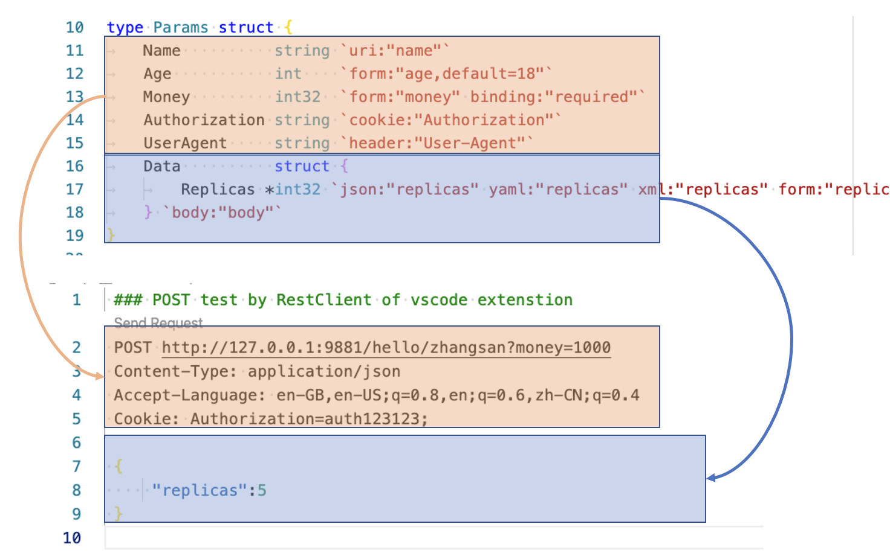
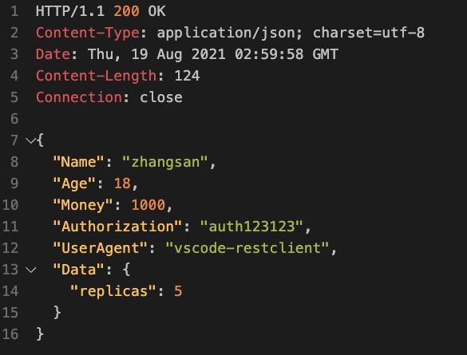
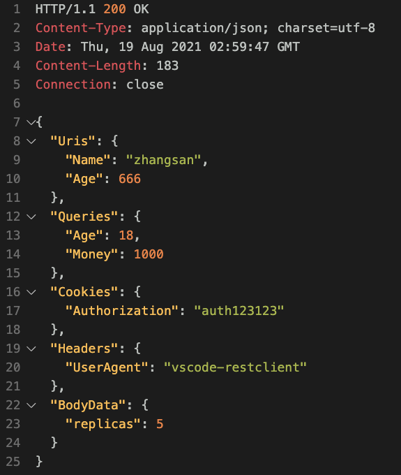
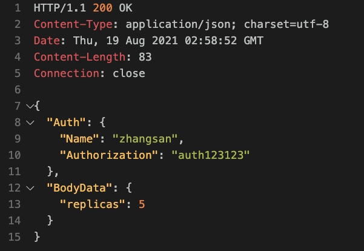

# ginbinder

一次绑定 Request 中所有需要的数据


## Usage

1. **废弃/不可用**: 弃用原生 tag `form` tag。
2. **保持**: 使用 tag `uri` 绑定路径中的参数。 **作用于某个字段**
    + 就是 `example.com/:some/:path` 中 **冒号后面的**
3. **保持**: 使用 tag `header` 绑定 header。 **作用于某个字段**
4. **新增**: 新增 tag `query` tag 绑定通过 Query 传递的参数。 **作用于某个字段**
    + 就是 `example.com/some/path?a=1&b=2` 中 问号后面的那一串
5. **新增**: 新增 tag `cookie` 绑定 cookie 中 **简单** 的键值对。 **作用于某个字段**
6. **新增**: 新增 tag `body` 绑定 `request.Body` 中的数据。 **必须作用于一个 `struct` 上。**
    + Body 数据的解析器通过 `content-type` 判断， 默认为 `Json`
    + Body 中的字段不能包含 `uri, query, cookie, header` 这些 tag， 否则会 panic。
    + `body` **只能有一个**
7. **新增**: 新增 tag `mime` 在代码中 **指定** 解析器， 优先于 `content-type`。 `body` 的协同，无法单独使用。
    + `json`, `yaml`, `xml`, `form`

### 按照 Request 结构管理参数

```go
type Params struct {
	Name          string `uri:"name"`
	Age           int    `query:"age,default=18"`
	Money         int32  `query:"money" binding:"required"`
	Authorization string `cookie:"Authorization"`
	UserAgent     string `header:"User-Agent"`
	Data          struct {
		Replicas *int32 `json:"replicas" yaml:"replicas" xml:"replicas" form:"replicas"`
	} `body:"body" mime:"json"`
}
```

如果层抓包捕获过 http 请求并观察过其结构。 那么应该很好理解这个格式。

这里放一张 `Params` 与 `Request` 的关系图以帮助理解。



> 图中有一个错误， `12/13 行` 的 `tag` 应该是 `query`。

按照 Request 结构设计参数很 **常用** 也很清晰。



### 按功能组管理参数

由于 gin 原生中的 `mapTag` 规则有 **递归** 的功能， 对 `Params` 的设计还可以进行一些改造。

可以按组配置 **非 body 参数**。 这里分组的 struct 名字不重要，也不需要为 struct 指定 `tag`。
但是 **一定要** 为字段指定了相应的 `tag`， 就会进行递归查找与绑定。

#### 1. 按照数据位置进行分组

这里按照 **参数** 在 Request 中的位置进行分组。

```go
type Params2 struct {
	Uris struct {
		Name string `uri:"name"`
		Age  int    `uri:"age"`
	}
	Queries struct {
		Age   int   `query:"age,default=18"`
		Money int32 `query:"money" binding:"required"`
	}
	Cookies struct {
		Authorization string `cookie:"Authorization"`
	}
	Headers struct {
		UserAgent string `header:"User-Agent"`
	}
	BodyData struct {
		Replicas *int32 `json:"replicas" yaml:"replicas" xml:"replicas" form:"replicas"`
	} `body:"body"`
}
```



#### 2. 按照功能/业务需求进行分组

这里按照参数的功能进行分组， 加入有一个功能是对用户进行权限验证。 需要结合 **name 和 auth**

```go
type Params3 struct {
	Auth struct {
		Name string `uri:"name"`
		Authorization string `cookie:"Authorization"`
	}
	BodyData struct {
		Replicas *int32 `json:"replicas" yaml:"replicas" xml:"replicas" form:"replicas"`
	} `body:"body"`
}
```



## exmaple

Demo 参考 [exmaple](./__example__)

使用 VsCode 的 Rest Client 可以快速测试


```bash
cd __example__

go run .
```